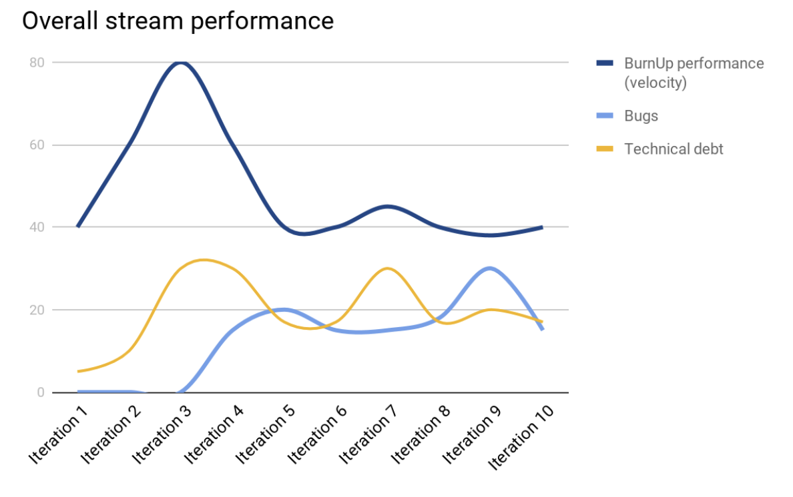

# Quality Analyst Use Case
## Context
As a new Quality Analyst in charge of quality assurance for the stream, you were able to gather a few mesures. 
The sprints last 1 week and the team is willing to go deep into agile practices. 

The team is doing their best but they have bugs and they are struggling to release new features. The Digital Leader is really worried because this is threatening the next release and could cause delay in the end.

You have the opportunity to help them by proposing any tool or team/individual practice you need.
We want quality! Please! Help us!

## Measures

